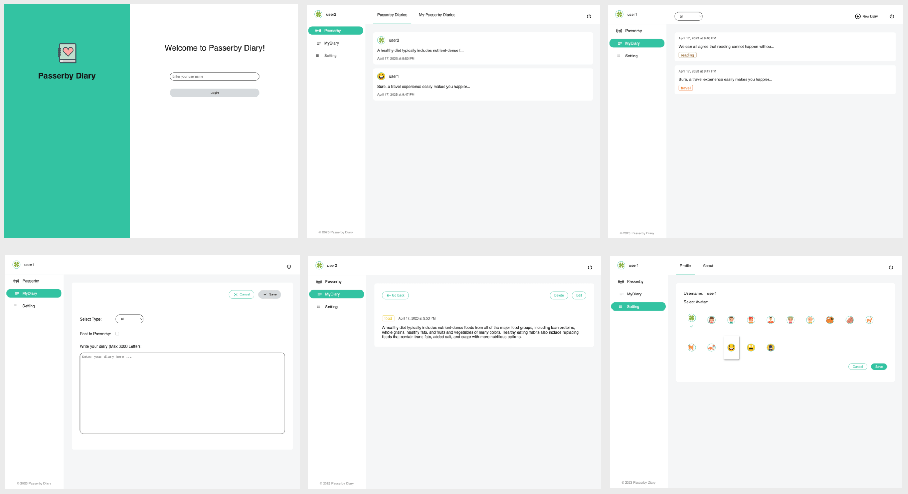

# Passerby Diary

This is the final project for INFO 6250 course.


## About The Project

Passerby Diary is a simple and sophisticated diary application that allows users to create and share their diaries. In addition, it has a "Passerby" section where users can post their diary, which are open to all users. However, passers-by can only view the passerby diaries, and they can't comment or connect with the diary owners. The app is designed to be a safe and private space for users to share their thoughts and experiences with others.

### Built With

- [React](https://reactjs.org/)
- [express](https://expressjs.com/)
- [cookie-parser](https://github.com/expressjs/cookie-parser)
- [uuid](https://github.com/uuidjs/uuid)


## Getting Started

### Prerequisites

- Node.js
- npm


### Installation

```
# Install the project
npm install

# Build the project
npm run build

# Run the project
npm run start

# For development mode
npm run server
npm run dev
```


## Visuals



Passerby Diary is designed to be intuitive and user-friendly, with a simple and clean interface that makes it easy to navigate and use.


## Usage

To use Passerby Diary, follow these simple steps:

- Create a new account or log in to an existing one.
- At the "Passerby" section, view the list of passerby diaries, and click on each passerby diary to view the details.
- At the "Mydiary" section, click "New Diary" in the upper right corner to start creating your diary. If you check "Post to Passerby", this will post to the "Passerby" section to share your thoughts with other users.
- At the "Mydiary" section, view the list of all your diaries. Click on each diary in this list to view its details, and edit or delete it.
- At the "Setting" section, view your profile and update your avatar.


## Source

- Logo and avatars are from https://www.iconfinder.com
- Icons are from https://css.gg


## Authors and acknowledgment

Author: Mengyun Xie
Date: Apr 17 2023


## License

[MIT](https://choosealicense.com/licenses/mit/)